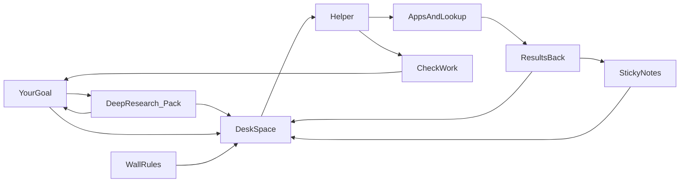

# LLM Leverage Course

## Goals

Learn how to get better answers from AI helpers.
We use one map called the **context loop**.
A loop is a path that goes around and comes back.

By the end, you can:

1. Explain how rules, tools, files, memory, and checks work together.
2. Do deep research before a project and save a short cited pack.
3. Improve a real workflow with clearer goals and better checks.
4. Use the same habits in ChatGPT, Claude, Cursor, Copilot, and similar tools.
5. Share one safe agent workspace with clear tools, rules, and owners.

## Audience

This course is for many kinds of teams.
You do not need to be an engineer for Modules 1–3 and Workshop 1.

## How to use this course

The home page (`/`) is for buyers evaluating the course; learners start at the Modules hub (`/modules`).

1. Pick a **role track** (Ops / Sales / Eng / Marketing) so examples match your job.
2. Download **BRIEF.md** and **SOURCES.md** templates from Resources.
3. Work modules in the recommended order. Each module has short steps (orient → ideas → apply), then practice, then quiz. Score 75% or higher to complete a module. You may jump ahead — Continue still points at the recommended next step.
4. After each workshop session, try the **static sandbox** (compare your draft to a model answer).
5. Finish with the **capstone** and skim the gallery for scoped examples.

## Simple words we reuse

Start here. The full course glossary (with hover tips in lessons) lives in the app at `/glossary`.

| Hard term | Plain meaning |
|-----------|----------------|
| Context window | Desk space for one homework session |
| Standing instructions | Rules on the classroom wall |
| Playbook | A recipe card for one kind of job |
| Tool / MCP | Apps the helper is allowed to open |
| Retrieval | Looking something up in a binder |
| Deep research | Fact-finding before you start |
| Compaction | A short note so you can clear the desk |
| Memory | Sticky notes for next time |
| Agent harness | The helper's workbench |
| Agentic framework | A builder kit for custom helper workflows |
| Shared workspace | A team project room |
| Verify | Checking your work before you turn it in |

## The loop

## Module list

| # | Slug | Title | Workshop |
|---|------|-------|----------|
| 1 | `mental-model` | Mental model | Session 1 |
| 2 | `deep-research` | Deep research | Session 1 |
| 3 | `system-instructions` | System instructions | Session 1 |
| 4 | `standing-playbooks` | Standing playbooks | Session 2 |
| 5 | `tools-and-mcp` | Tools & MCP | Session 2 |
| 6 | `retrieval-and-grounding` | Retrieval & grounding | Session 2 |
| 7 | `conversation-and-compaction` | Conversation & compaction | Session 3 |
| 8 | `memory-systems` | Memory systems | Session 3 |
| 9 | `delegation` | Delegation and shared workspaces | Session 3 |
| 10 | `human-craft` | Human craft | Session 4 |
| 11 | `verify-and-harden` | Verify & harden | Session 4 |
| 12 | `capstone-lab` | Capstone lab | Session 4 |

## Workshops

| Session | Modules | Focus |
|---------|---------|--------|
| 1 | 1–3 | Map, research pack, wall rules |
| 2 | 4–6 | Recipe cards, tools, lookup |
| 3 | 7–9 | Clean chats, memory, specialists, shared workspace |
| 4 | 10–12 | Clear asks, checks, real practice |

Slide decks live in `curriculum/workshops/session-XX.slides.yaml`.
Self-paced module links stay on each workshop page.

## Success looks like

- After Modules 1–3, you can explain the loop and make a BRIEF.md + SOURCES.md pack.
- After the full course, you can set rules, tools, and checks on top of that pack.
- You can tell a harness from a framework and share safe team defaults.
- Class and self-paced learners share one syllabus.
