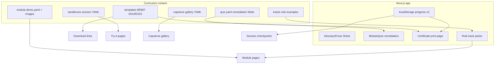

# Learner Experience + Teaching Quality Implementation Plan

> **For agentic workers:** REQUIRED SUB-SKILL: Use `superpowers:subagent-driven-development` (recommended) or `superpowers:executing-plans` to implement this plan task-by-task. Steps use checkbox (`- [ ]`) syntax for tracking.

**Goal:** Improve how learners experience progress, practice, and glossary help—and how teaching content lands for different roles—without adding auth or abandoning the tool-agnostic spine.

**Architecture:** Keep curriculum as the source of truth under `curriculum/`. Extend localStorage progress for checkpoints/certificates. Add static media and sandbox content as YAML/MD next to modules. Role tracks inject example callouts (not full duplicated lessons). Quiz explanations gain structured remediation links. Mobile glossary upgrades `GlossaryProse` to a Sheet on coarse pointers.

**Tech Stack:** Next.js App Router, existing progress provider, shadcn Sheet/Dialog/Tabs, Vitest + Playwright, static files in `public/course/`, YAML via `yaml`.

## Locked defaults (no TBD)

| Decision | Choice | Why |
|----------|--------|-----|
| Try-it sandboxes | **Static** compare-your-draft vs model answer (no live LLM API) | Keeps course tool-agnostic, no API keys, works offline after deploy |
| Worked demos v1 | **Annotated screenshots** (optional short loop GIF later) | Faster to author; no video hosting |
| Role tracks | **Overlay examples** via `curriculum/tracks/*.yaml` + UI picker | One lesson spine; role-specific stories without 4× content |
| Certificates | **Printable client page** (browser Print → PDF) | No server; works with localStorage progress |
| Templates | Markdown downloads from `curriculum/templates/` | Matches BRIEF.md / SOURCES.md teaching |

## Scope covered

**Learner experience**
1. Earned progress (checkpoints, certificates, template downloads)
2. Worked demos (before/after screenshots)
3. Mobile glossary sheet
4. Try-it sandboxes (static)

**Teaching quality**
5. Role tracks (ops / sales / eng / marketing)
6. Capstone gallery
7. Quiz remediation links

## Out of scope

- Live model API playgrounds
- Auth, team progress, LMS SSO
- Rewriting facilitator notes to grade-5
- Analytics product (can add later)

## Data flow (high level)



## Progress model extension

Bump storage key to `llm-course-progress-v2` with migration from v1:

```ts
type CourseProgressV2 = {
  completedModules: string[];
  completedExercises: Record<string, string[]>;
  quizScores: Record<string, number>;
  revealedAnswers: Record<string, string[]>;
  roleTrack: "general" | "ops" | "sales" | "eng" | "marketing";
  checkpoints: string[]; // e.g. "session-1-pack", "session-2-runbook"
  sandboxAttempts: Record<string, { comparedAt: string }>;
  certificateClaims: string[]; // module ids or "course-complete"
};
```

---

### Task 1: Mobile glossary sheet

**Files:**
- Modify: [`src/components/glossary-prose.tsx`](src/components/glossary-prose.tsx)
- Create: `src/components/ui/sheet.tsx` if missing (already present — reuse)
- Test: extend [`e2e/smoke.spec.ts`](e2e/smoke.spec.ts) with touch/coarse path or click-to-sheet
- Modify: [`src/app/globals.css`](src/app/globals.css) as needed

**Behavior:**
- Fine pointer (mouse): keep hover tip + click navigates to glossary
- Coarse pointer / tap: first tap opens Sheet with shortDefinition, longDefinition excerpt (fetch from embedded JSON prop or data attributes), link “Open full glossary”, second action can navigate
- Pass `termsById` map into `GlossaryProse` from server pages so Sheet can show long text without a fetch

- [ ] Write failing Playwright: tap/click glossary term opens dialog/sheet with tip text
- [ ] Implement Sheet path; keep desktop hover
- [ ] Commit

### Task 2: Quiz remediation

**Files:**
- Modify: quiz YAML schema in all `curriculum/modules/*/quiz.yaml`
- Modify: [`src/lib/curriculum/types.ts`](src/lib/curriculum/types.ts), loaders
- Modify: [`src/components/module-quiz.tsx`](src/components/module-quiz.tsx)
- Test: `src/lib/curriculum/quiz-remediation.test.ts`

**Schema addition per question:**

```yaml
remediation:
  lessonHeading: "Big ideas"   # hashified to #big-ideas on module page
  glossaryIds: [retrieval, grounding]
  moduleSlug: retrieval-and-grounding  # optional override; default current module
```

**UI:** After submit, wrong answers show explanation **plus** links: “Review: Big ideas” → `/modules/{slug}#…` and glossary chips.

- [ ] Add heading ids to lesson rendering (slugify H2s in `GlossaryProse` or markdown render)
- [ ] Failing test: loader returns remediation; quiz UI types accept it
- [ ] Author remediation for all 12 quizzes (can batch)
- [ ] Commit

### Task 3: Lesson heading anchors

**Files:**
- Modify: [`src/lib/markdown.ts`](src/lib/markdown.ts) or marked renderer to add `id` on h2/h3
- Test: markdown unit test for id generation

Needed for Task 2 deep links and worked-demo anchors.

- [ ] Failing test for `## Big ideas` → `id="big-ideas"`
- [ ] Implement
- [ ] Commit

### Task 4: Downloadable BRIEF / SOURCES templates

**Files:**
- Create: `curriculum/templates/BRIEF.md`
- Create: `curriculum/templates/SOURCES.md`
- Create: `curriculum/templates/HANDOFF.md` (compaction handoff)
- Create: `src/app/api/templates/[name]/route.ts` **or** copy into `public/templates/` at build — prefer **`public/templates/`** synced from curriculum (script or commit both)
- Modify: Module 2 page / deep-research lesson UI callout + home resources strip
- Modify: [`docs/COURSE_OPERATIONS.md`](docs/COURSE_OPERATIONS.md)

- [ ] Author grade-5 template files with placeholders
- [ ] Expose download links on Module 2, capstone, and `/glossary` or new `/resources`
- [ ] Commit

### Task 5: Session checkpoints + certificates

**Files:**
- Modify: [`src/lib/progress/progress.ts`](src/lib/progress/progress.ts) + tests (v2 + migration)
- Modify: [`src/components/progress-provider.tsx`](src/components/progress-provider.tsx)
- Create: `src/lib/progress/checkpoints.ts` (rules: Session 1 = modules 1–3 complete + optional checkbox “I saved BRIEF/SOURCES”)
- Create: `src/app/certificates/[id]/page.tsx` (print CSS)
- Create: `src/components/checkpoint-banner.tsx`, `src/components/certificate-card.tsx`
- Modify: modules index + home to show checkpoint badges

**Certificates:**
- Per-module: unlocked when module complete + quiz submitted (any score)
- Session: unlocked when session’s modules complete
- Course: all 12 modules complete
- Page shows name field (local only, typed at print time), date, checklist of skills

- [ ] Failing progress tests for migration and checkpoint computation
- [ ] Implement UI + print stylesheet
- [ ] E2E: complete module → certificate link appears
- [ ] Commit

### Task 6: Worked demos (screenshots)

**Files:**
- Create: `curriculum/modules/{slug}/demo.yaml` (optional per module)
- Create: `public/course/demos/{slug}/before.png`, `after.png` (start with modules 5, 6, 11; then fill rest)
- Create: `src/lib/curriculum/load-demo.ts`
- Create: `src/components/worked-demo.tsx`
- Modify: module page to render demo under walkthrough / after Big ideas
- Modify: STYLE_GUIDE + content test: modules 5, 6, 11 must have demo.yaml

**demo.yaml schema:**

```yaml
title: "Ungrounded vs grounded answer"
captionBefore: "No binder attached — confident wrong number."
captionAfter: "SOURCES.md attached — cite then answer."
beforeImage: /course/demos/retrieval-and-grounding/before.png
afterImage: /course/demos/retrieval-and-grounding/after.png
altBefore: "..."
altAfter: "..."
```

Use realistic **anonymized UI mock screenshots** (static PNG). Do not require real product branding; use generic “Helper” chrome so the course stays tool-agnostic.

- [ ] Ship demos for tools-and-mcp, retrieval-and-grounding, verify-and-harden
- [ ] Component with before/after toggle
- [ ] Commit
- [ ] Follow-up commit: remaining modules (lighter demos OK)

### Task 7: Role tracks

**Files:**
- Create: `curriculum/tracks/general.yaml` (default empty / shared)
- Create: `curriculum/tracks/ops.yaml`, `sales.yaml`, `eng.yaml`, `marketing.yaml`
- Create: `src/lib/curriculum/tracks.ts` + tests
- Create: `src/components/role-track-picker.tsx`
- Modify: module page to show “Example for your role” callout from track file keyed by module slug
- Persist `roleTrack` in progress v2

**Track entry shape:**

```yaml
id: sales
label: Sales
modules:
  deep-research:
    story: "You prep a first call..."
    exampleAsk: "..."
    watchOut: "..."
```

Every track must define overlays for at least modules 2, 5, 6, 10, 12; others fall back to general.

- [ ] Failing test: load track; missing module falls back
- [ ] Picker in header or modules index
- [ ] Callout on module pages
- [ ] Commit

### Task 8: Try-it sandboxes (static)

**Files:**
- Create: `curriculum/sandboxes/session-01.yaml` … `session-04.yaml`
- Create: `src/lib/curriculum/load-sandboxes.ts` + tests
- Create: `src/app/try/[sessionId]/page.tsx`
- Create: `src/components/try-it-sandbox.tsx`
- Link from each workshop page + Session modules

**Sandbox YAML:**

```yaml
id: session-01
title: "Write a grounded wall rule"
starterPrompt: |
  ...
constraints:
  - "Do not invent numbers"
  - "Point to BRIEF.md"
modelAnswer: |
  ...
rubric:
  - "Mentions BRIEF or SOURCES"
  - "One always/never line"
```

**UI:** Starter prompt (copy button) → textarea for learner draft → “Compare” reveals model answer + checklist (manual self-check, not AI graded). Record `sandboxAttempts` in progress.

- [ ] Four sandboxes authored
- [ ] Page + compare UI + tests
- [ ] Commit

### Task 9: Capstone gallery

**Files:**
- Create: `curriculum/gallery/capstone-examples.yaml`
- Create: `public/course/gallery/{id}/...` optional images
- Create: `src/app/gallery/page.tsx`
- Create: `src/components/gallery-card.tsx`
- Link from Module 12 + Workshop 4

**Entry shape:** anonymized role, workflow, before metric, after metric, what they configured (wall / pack / tools / verify), one lesson learned. 4–6 seed examples covering different roles.

- [ ] Author 4+ examples
- [ ] Gallery page
- [ ] Commit

### Task 10: Resources hub + nav

**Files:**
- Create: `src/app/resources/page.tsx` (templates, sandboxes, gallery, glossary links)
- Modify: [`src/components/site-header.tsx`](src/components/site-header.tsx)
- Modify: home page CTAs

- [ ] Single place for downloads and practice
- [ ] Commit

### Task 11: Quality gates, docs, ship

**Files:**
- Modify: content-quality / progress tests as needed
- Modify: [`docs/COURSE_OPERATIONS.md`](docs/COURSE_OPERATIONS.md)
- Modify: [`curriculum/COURSE.md`](curriculum/COURSE.md) short “How to use this course” with tracks + sandboxes
- E2E: glossary sheet, certificate, sandbox compare, gallery
- Deploy + push

- [ ] `npm test && npm run test:e2e && npm run build`
- [ ] Prod deploy
- [ ] Commit

---

## Phased delivery (recommended)

| Phase | Tasks | Outcome |
|-------|-------|---------|
| **P0 – Friction** | 1, 2, 3 | Mobile glossary + quiz deep links work |
| **P1 – Momentum** | 4, 5, 10 | Templates, checkpoints, certificates, resources hub |
| **P2 – Clarity** | 6, 7 | Screenshots + role examples |
| **P3 – Practice** | 8, 9, 11 | Sandboxes, gallery, ship |

Each phase should be independently demoable on production.

## Success criteria

- On a phone, tapping a glossary term opens a readable sheet (not only hover).
- Wrong quiz answers link to a lesson heading and/or glossary term.
- Learner can download BRIEF.md / SOURCES.md starters in one click.
- Completing Session 1 modules unlocks a printable session certificate.
- Modules 5/6/11 show a before/after demo.
- Choosing “Sales” changes at least one example callout on Module 2.
- Each workshop session has a static try-it compare exercise.
- Capstone gallery shows ≥4 anonymized runs.
- All tests green; no live LLM dependency.

## Effort sketch

Rough agent/engineer days if done in order: P0 (~1–2d), P1 (~2d), P2 (~2–3d incl. image authoring), P3 (~2d). Total ~7–9 focused days.
